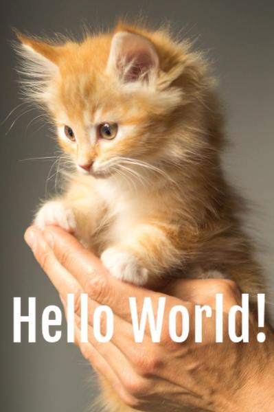

# MEMEBOT

## What is Memebot?
Check out our [blog post](https://www.ghyston.com/the-thinking/automating-humour-on-slack-with-memebot/) for an explanation of why and how Memebot came about.

Memebot is a [Slack](https://slack.com/) bot for automatically generating memes in Slack conversations. You can build up a collection of different images with which to create memes from.

Simply tag Memebot in a message in a channel or conversation in which Memebot is present, followed by the name of a picture in your library you want to be memed, then the text to be placed in the image. If you send the message `@memebot kitten Hello World!`, Memebot will reply with the image:

To deploy simply run `python memebot.py`. You must have setup Memebot within Slack first and have defined the environment variables `BOT_ID` and `BOT_TOKEN`.  Guidance on how to do this and get a simple Slack bot running is [here](https://www.fullstackpython.com/blog/build-first-slack-bot-python.html).

## Guidance for extending Memebot

### Adding memes to Memebot
Simply add a new meme to Memebot by:

* Add a jpg image to the *photos* directory (keep to approximately 1000px height and width and no more than about 300kB) OR a GIF image (keep this small)
* Add an entry into the dictionary in *memelist.py* with the key being a string of the text which links to that meme (e.g. `'kitten'`) and the value being an `ImageDetails` object with the following parameters:
    * The name of the image file in the *photos/* directory, e.g. `'kitten.jpg'`
    * A tuple containing the pixel coordinates of the top left corner of the rectangle to place the text within
    * A tuple containing the *(x, y)* size in pixels of the rectangle for the text to be placed within
    * *(Optional)* The name of a .ttf font file (which must be placed within the *fonts/* directory) to be used instead of the default font
    * *(Optional)* A tuple containing the *RGB* values for the colour of text to be added (default white)
    * *(Optional)* A counter-clockwise rotation in degrees to rotate the text through
    * *(Optional)* If the meme is a GIF the field `is_gif` must be set to `True`, otherwise it can be ignored
* The new meme can be tested by running *addtext.py* from the terminal, e.g. `python addtext.py kitten "Hello world"` and the resulting meme should be displayed in your default photo viewer.
    * Python 3 and PILLOW are required for this to work. Once Python 3 and pip (comes bundled with Python3) are installed, PILLOW can be installed by running `pip install pillow`.

### Custom Responses with Memebot
Memebot supports custom responses to certain keywords being said in a channel where Memebot is present. Custom responses are defined in the *customresponses.py* file. To set up a custom response:

* Define a function to be called whenever a keyword is received. For instance, randomly selecting out of a choice of predefined memes.
* Add the keyword as the key in the *phrases* dictionary, and a reference to the defined function as the value.

### Notes
I use paint.net to downsize images to the right pixel coordinates, then use the rectangle select tool to select an area where the text will go. The lower left corner of the window then gives the top left coordinates and size of the area which can be entered straight into the *memelist.py* file.

### Developing Memebot
The primary functionality of Memebot is split between two files:

* *addtext.py* contains the code to add text to an image. For testing it can be run from the terminal `python addtext.py kitten "Hello world"` and the resulting meme should be displayed in your default photo viewer.
* *memebot.py* contains the interface with the slack API. This is currently very basic, it simply gets updates from the Slack webchat API every second, parses the text for its name, and takes the following string and tries to turn it into a meme. If there is an error or the string isn't recognised it simply doesn't respond.
